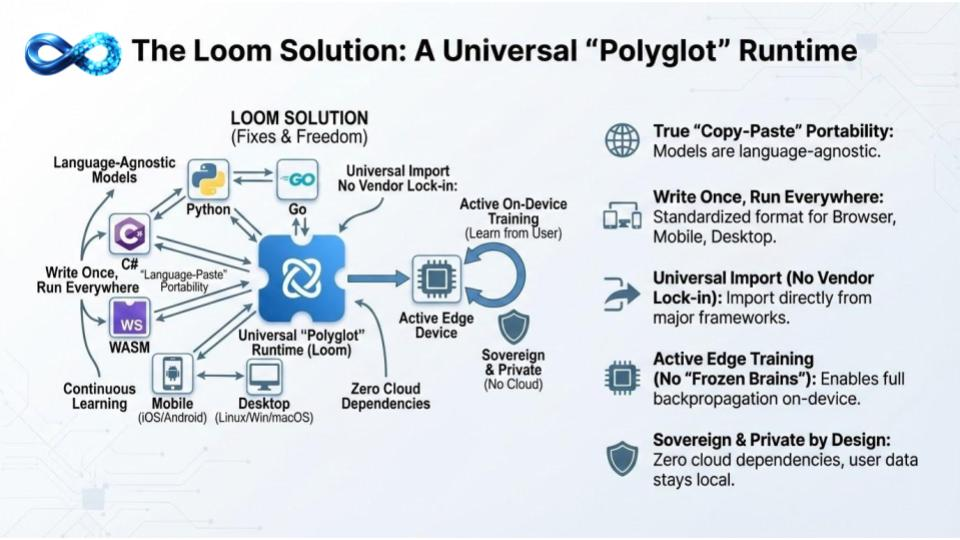

# LOOM: Universal Bit-Perfect Deterministic AI Engine

**"The SQLite of AI" — A Polyglot Neural Engine with Bit-Exact Reproducibility**

Loom is a **Deterministic Neural Virtual Machine (DNVM)** engineered for absolute numerical consistency and extreme efficiency. It guarantees **bitwise-identical results** across all platforms, backends, and language bindings, bypassing memory bandwidth bottlenecks through polymorphic dispatch and volumetric 3D modeling.

## 🌐 The Polyglot Solution
Loom is designed as a universal runtime that prioritizes portability and sovereignty:

- **True "Copy-Paste" Portability**: Models are language-agnostic. Move weights and logic between Go, Python, C#, and WASM without translation layers.
- **Write Once, Run Everywhere**: A standardized format that performs identically on Browser (WASM/WebGPU), Mobile (iOS/Android), and Desktop (Linux/Windows/macOS).
- **Universal Import**: Direct ingestion from major frameworks—zero vendor lock-in.
- **Active Edge Training**: Full backpropagation enabled on-device. No "frozen brains"; Loom learns from user interaction at the edge.
- **Sovereign & Private**: Zero cloud dependencies. User data and model execution remain 100% local.

## 💎 The Bedrock Philosophy
Loom is a **"Bedrock Edition"** neural engine. Unlike standard frameworks that build on top of high-level abstractions, Loom is designed at the bit-level to bypass the physical memory limitations of consumer hardware. 

- **Cross-Platform Determinism**: 0.0000000000 difference between CPU and GPU, x86 and ARM, native and browser.
- **Universal Precision**: Native support for 21 numerical types (FP64 to 1-bit Binary), allowing Loom to "morph" precision to match specific silicon preferences.
- **Bit-Perfect Identity**: Verified across hundreds of permutations with 0.000000% mathematical divergence.

## 🚀 The Technical Pillars (Final Form)
The project has transitioned to the **Multi-numerical POLYmorphic Volumetric Tiled-tensor Dispatcher (M-POLY-VTD)** core.

- **Systolic Neural Mesh**: A living mesh architecture with clock-cycle accurate updates and temporal feedback loops that simulate biological neural firing.
- **DNA Engine**: A hierarchical spatial correlation system that extracts topological "signatures" of models, enabling high-fidelity comparison and "Logic Shift" detection in 3D space.
- **Neural Target Propagation (TargetProp)**: A robust alternative to backpropagation that uses localized, gap-based Hebbian learning to bridge the difference beTargetProp actual and idealized activations.
- **Bit-Packed Persistence**: An idempotent serialization tunnel that achieves up to **98.4% compression**, allowing extreme model sizes to fit in consumer RAM/VRAM.

## 📂 Project Structure
- **[`poly/`](./poly/)**: The current-generation engine core (M-POLY-VTD). This is where active development happens.
- **[`legacy/`](./legacy/)**: Historical codebase and previous iterations of Loom.

## 🛠️ Getting Started
For technical deep-dives into M-POLY-VTD, refer to the documentation and benchmarks within the [`poly/`](./poly/) core. 

Loom provides bit-exact reproducibility across:
- **Go** (Native)
- [**TypeScript/Node.js**](https://www.npmjs.com/package/@openfluke/welvet) (@openfluke/welvet)
- **Browser** (WASM + WebGPU)
- [**Python**](https://pypi.org/project/welvet/) (welvet)
- **C#/.NET** (Welvet) - *(In Development)*

## 📊 Versioning & Roadmap
Loom uses a mathematical versioning system derived from a strictly verified checklist of 130 industry-scale features.

### **Current Version: 0.74.0 (Alpha)**
- **Completion Ratio**: 73.8% (96 / 130 features verified — TypeScript/WASM Stable)
- **Status**: Core structures are stable. FP4 acceleration is native on both CPU and GPU.
    - > [!NOTE]
    - > **GPU Backward Training**: Full end-to-end GPU training is now live. Dense, RMSNorm, CNN 1D/2D/3D all run forward + backward + weight updates in a **single GPU command buffer submission** via the `BeginFrame`/`FlushFrame` pattern. Measured speedups on real workloads: **17x–65x** vs CPU across all supported layer types.
- **Roadmap Target**:
    - **v0.74.0 "Polyglot Bridge"**: Launching now. TypeScript/WASM implementation is stable and verified with 0.000000% divergence.
    - **v0.8.0 "Major Launch"**: Broader release once the Python ecosystem is fully stabilized.
- **Next Steps**: Wiring SwiGLU/MHA/Embedding into `DispatchBackwardLayer`; Transitioning to specialized **Edge-First** orchestration (Thermal-Awareness, UMA, Command Buffer Graphing).

For a detailed breakdown of the roadmap and version calculation, see [poly/README.md](./poly/README.md#📊-true-version-calculation).

---

## License

Apache License 2.0 - see [LICENSE](LICENSE) file for details.

---

*Loom: Universal precision. Volumetric freedom. Bedrock performance.*

**Made with ❤️ by Openfluke**