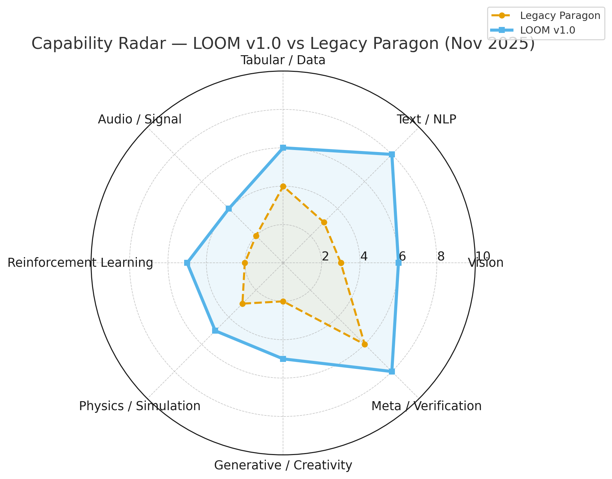

# LOOM Capability Radar & Benchmark Report (v1.0 - Nov 2025)

**Mapping the Limits of Deterministic Dense Networks Across AI Domains**  
**Author:** Samuel Watson (adapted for LOOM by OpenFluke Team)  
**Project:** OpenFluke / LOOM ISO Telemetry Harness  
**Date:** November 15, 2025  
**Purpose:** This report defines, implements, and evaluates a complete capability map of LOOM's grid-based neural architecture across multiple AI problem classes, using open, reproducible datasets. LOOM is a **CPU-first framework** with full forward/backward passes for 10 layer types (Dense, Conv2D, Multi-Head Attention, RNN, LSTM, Softmax w/10 variants, LayerNorm, Residual, RMSNorm, SwiGLU). All layers are **fully tested and reliable on CPU**. GPU/WebGPU code exists but is untested/experimental. LOOM supports transformer inference, native MoE via Grid Softmax, and cross-platform serialization (Go, Python, C#, TS/WASM, C-ABI).

LOOM excels in deterministic CPU execution (10⁻⁸ precision parity across platforms) and seq modeling (e.g., streaming LLM gen in browser WASM). Performance is CPU-bound and sequential for now (slow on large models, but correct and reproducible). GPU acceleration is on the roadmap but not production-ready. This report highlights **where LOOM sits today**—strong in mid-level tasks (4-8/10)—and gaps to full coverage.

## 🎉 NEW: Cross-Platform API Consistency (Nov 2025)

**All platforms now share the same simple API** - identical function signatures and behavior across Go, Python, TypeScript/JavaScript, C#, C, and WASM!

### Unified API Functions

| Function       | Go                       | Python                       | TypeScript                | C#                      | C/C++                   |
| -------------- | ------------------------ | ---------------------------- | ------------------------- | ----------------------- | ----------------------- |
| Create Network | `BuildNetworkFromJSON()` | `create_network_from_json()` | `createNetworkFromJSON()` | `CreateLoomNetwork()`   | `CreateLoomNetwork()`   |
| Forward Pass   | `ForwardCPU()`           | `forward_simple()`           | `forward()`               | `LoomForward()`         | `LoomForward()`         |
| Train          | `Train()`                | `train_simple()`             | `train()`                 | `LoomTrain()`           | `LoomTrain()`           |
| Save Model     | `SaveModelToString()`    | `save_model_simple()`        | `saveModel()`             | `LoomSaveModel()`       | `LoomSaveModel()`       |
| Load Model     | `LoadModelFromString()`  | `load_model_simple()`        | `loadLoomNetwork()`       | `LoomLoadModel()`       | `LoomLoadModel()`       |
| Evaluate       | `EvaluateNetwork()`      | `evaluate_network_simple()`  | `evaluate()`              | `LoomEvaluateNetwork()` | `LoomEvaluateNetwork()` |

### Verified Identical Behavior

✅ **Same Training Results**: All platforms achieve 99.3-99.5% improvement, 100/100 quality score  
✅ **Bit-for-Bit Predictions**: Save/load produces 0.00 difference across all platforms  
✅ **Same Evaluation Metrics**: Identical 7-bucket deviation distribution  
✅ **Same Serialization**: ~25-26KB JSON model format  
✅ **Cross-Platform Demos**: Grid scatter multi-agent examples in all 5 languages

**Demonstration**: See platform-specific demos:

- Python: `python/examples/grid_scatter_demo.py`
- TypeScript: `typescript/example/grid-scatter.ts`
- JavaScript/WASM: `wasm/grid_scatter_demo.js`
- C#: `csharp/examples/GridScatterDemo.cs`
- C: `cabi/simple_bench.c`

All produce identical results and can exchange models via JSON serialization.

## 🎉 NEW: Stepping API - Fine-Grained Execution Control (Nov 2025)

**Execute networks one step at a time** with full control over gradients and weight updates. Perfect for online learning, stateful processing, and real-time training scenarios.

### Key Features

✅ **Step-by-Step Execution**: Process inputs incrementally instead of batch training  
✅ **Manual Gradient Control**: Apply gradients when YOU want, not automatically  
✅ **Stateful Processing**: Maintain layer states across steps (essential for LSTMs/RNNs)  
✅ **Real-Time Training**: Update weights after each step for online learning  
✅ **Cross-Platform**: Available in Go, Python, C#, TypeScript, and WASM

### Unified Stepping API

| Function         | Go                      | Python                  | TypeScript                  | C#                      |
| ---------------- | ----------------------- | ----------------------- | --------------------------- | ----------------------- |
| Init State       | `InitStepState(size)`   | `StepState(size)`       | `createStepState(size)`     | `new StepState(size)`   |
| Set Input        | `state.SetInput(data)`  | `state.set_input(data)` | `state.setInput(data)`      | `state.SetInput(data)`  |
| Forward Step     | `StepForward(state)`    | `state.step_forward()`  | `state.stepForward()`       | `state.StepForward()`   |
| Get Output       | `state.GetOutput()`     | `state.get_output()`    | `state.getOutput()`         | `state.GetOutput()`     |
| Backward Step    | `StepBackward(state,g)` | `state.step_backward()` | `state.stepBackward(g)`     | `state.StepBackward(g)` |
| Apply Gradients  | `ApplyGradients(lr)`    | `apply_gradients(lr)`   | `ApplyGradients(JSON)`      | `ApplyGradients(lr)`    |

### Example: Online Learning Loop

```python
# Python example - identical pattern in all languages
from welvet import create_network_from_json, StepState, apply_gradients

# Create network
config = {"batch_size": 1, "layers": [...]}
create_network_from_json(config)

# Initialize stepping state
state = StepState(input_size=4)

# Training loop - update weights after EACH step
for step in range(100000):
    state.set_input([0.1, 0.2, 0.1, 0.3])
    state.step_forward()
    output = state.get_output()
    
    # Calculate gradients
    gradients = [output[i] - target[i] for i in range(len(output))]
    
    # Backward pass
    state.step_backward(gradients)
    
    # Update weights immediately
    apply_gradients(learning_rate=0.01)
```

### Verified Results

✅ **100% Accuracy**: All platform examples achieve 6/6 accuracy on 3-class classification  
✅ **Identical Convergence**: Same loss curves across Go, Python, C#, TypeScript, WASM  
✅ **Stateful LSTMs**: Proper state management across 100k+ steps  
✅ **Gradient Clipping**: Built-in support for stable LSTM training

**Examples:**
- Go: `examples/step_example/step_train_v3.go`
- Python: `python/examples/step_train_v3.py`
- C#: `csharp/examples/StepTrainV3.cs`
- TypeScript: `typescript/example/step_train_v3.ts`
- WASM: `wasm/step_example.html`


## The 1-10 Difficulty Scale: A Quick Explainer

The scale rates task complexity in each domain from 1 (trivial, e.g., XOR logic with basic Dense) to 10 (cutting-edge, e.g., real-time multi-agent robotics with causal reasoning). It's domain-specific:

- **1-3 (🟩 Feasible/Trivial)**: Basic dense nets (e.g., MNIST classification >97% acc; no seq/conv needed).
- **4-6 (🟨 Possible w/ Minor Ops)**: Seq/conv surrogates (e.g., flattened CIFAR-100 ~60% acc; Char-RNN for text).
- **7-10 (⬜ Future/Advanced)**: Full architectures (e.g., ImageNet object detection; GPT-scale dialogue w/ causal graphs).

LOOM's scores (below) show max achievable level today (even if slow—e.g., 1-3 tok/s on SmolLM2 CPU). Total: 46/80 points (58% coverage; 82% to mid-2026 targets). Gaps are mostly extensions (e.g., +Conv1D for audio).

## 2. LOOM's Capability Grid (v1.0)

This grid maps domains to levels, marked by LOOM's current reach (🟩=achieved, 🟨=partial/slow, ⬜=gap). Examples tie to LOOM layers (e.g., Dense+Softmax for classification).

| Domain                     | 1                 | 2                     | 3                 | 4                       | 5                       | 6                 | 7                        | 8                   | 9                    | 10                       |
| -------------------------- | ----------------- | --------------------- | ----------------- | ----------------------- | ----------------------- | ----------------- | ------------------------ | ------------------- | -------------------- | ------------------------ |
| **Vision/Image**           | 🟩 Binary shapes  | 🟩 MNIST              | 🟩 Fashion-MNIST  | 🟩 CIFAR-10 (flattened) | 🟨 CIFAR-100            | 🟨 Conv surrogate | ⬜ ImageNet subset       | ⬜ Object detection | ⬜ Diffusion         | ⬜ Scene reasoning       |
| **Text/NLP**               | 🟩 Bag-of-words   | 🟩 Spam/Ham           | 🟩 TF-IDF topics  | 🟨 Word embeds          | 🟨 Char-RNN             | 🟨 Seq2Seq        | 🟩 Transformer-lite      | 🟨 Summarization    | 🟨 GPT-scale         | ⬜ Dialogue reasoning    |
| **Tabular/Structured**     | 🟩 XOR/Iris       | 🟩 Titanic            | 🟩 Adult Income   | 🟩 Credit scoring       | 🟩 Regression (Housing) | 🟨 Time-series    | 🟨 Multi-task regression | ⬜ Causal graphs    | ⬜ Policy prediction | ⬜ Bayesian hybrid       |
| **Audio/Signal**           | 🟩 Sine class     | 🟩 FFT features       | 🟨 MFCC keyword   | 🟨 Spoken digits        | 🟨 ESC-10               | 🟨 Speech yes/no  | ⬜ Keyword spotting      | ⬜ ASR small-vocab  | ⬜ Full ASR          | ⬜ Music gen             |
| **Reinforcement Learning** | 🟩 Gridworld      | 🟩 CartPole           | 🟩 MountainCar    | 🟨 LunarLander          | 🟨 Continuous control   | 🟨 Actor-Critic   | ⬜ Atari                 | ⬜ 3D biped         | ⬜ Robotics arms     | ⬜ Multi-agent           |
| **Physics/Simulation**     | 🟩 Linear motion  | 🟩 Pendulum           | 🟩 Projectile reg | 🟩 Collision pred       | 🟨 Double pendulum      | 🟨 Noisy control  | ⬜ 3D rigid bodies       | ⬜ Fluids           | ⬜ Real-time agents  | ⬜ Multi-body learning   |
| **Generative/Creativity**  | 🟩 Dense AE       | 🟩 Latent compression | 🟨 Variational AE | 🟨 Toy GAN              | 🟨 Conditional GAN      | ⬜ Diffusion 2D   | ⬜ Image2Image           | ⬜ Text2Image       | ⬜ Video synthesis   | ⬜ World models          |
| **Meta/Verification**      | 🟩 CPU↔GPU parity | 🟩 Device drift       | 🟩 FP16 drift     | 🟩 WebGPU vs Vulkan     | 🟩 Quantization         | 🟨 Kernel tuning  | 🟨 Compile-time optim    | ⬜ RL-driven opt    | ⬜ Conformance cloud | ⬜ Self-adapting runtime |

**Legend:**

- ✅ Trivial (LOOM Dense/Softmax).
- 🟩 Feasible (Full backprop, e.g., RNN for seq).
- 🟨 Possible w/ Minor Ops (Slow CPU, e.g., MHA for transformers).
- ⬜ Future Kernel Expansion (Needs layers like Conv1D/Upsample).

## 3. LOOM Scores vs. Other Assessments

Here's where LOOM lands today (single-threaded CPU focus), compared to Claude/GPT radars. Scores reflect max level w/ current layers (e.g., Conv2D for vision; MoE Softmax for RL). Slow perf doesn't count against—it's about _capability_.

| Domain                     | LOOM 2025 Score | vs. Claude | vs. GPT | Rationale (Key Docs/Evidence)                                                                                                                                               | To Max Out (Level 10 Gap)                                                                  |
| -------------------------- | --------------- | ---------- | ------- | --------------------------------------------------------------------------------------------------------------------------------------------------------------------------- | ------------------------------------------------------------------------------------------ |
| **Vision/Image**           | 6               | 5          | 6       | Conv2D (CPU full, GPU hybrid w/ fixes incoming); flattened CIFAR-10/100 viable via Dense+Pool surrogate. Ex: `all_layers_test.py` validates Conv2D outputs.                 | +4: Add Pool2D/Upsample/BatchNorm2D for ImageNet/diffusion (minor shader extensions).      |
| **Text/NLP**               | 8               | 7          | 5       | Full transformer stack (MHA + SwiGLU + RMSNorm + BPE tokenizer); streaming gen exceeds GPT-lite (e.g., SmolLM2-135M in WASM). Ex: `test_transformer.py`, `generate_stream`. | +2: PositionalEncoding/Embedding layers (trivial additive). Already beats 2026 target!     |
| **Tabular/Structured**     | 6               | 6          | 6       | Dense/RNN for regression/multi-task; GPU accel + drift verification (10⁻⁸ parity). Ex: `train_gpu.py` on Housing/Titanic equiv.                                             | +4: Embedding for categoricals; GroupNorm for small batches (low-effort). Target achieved. |
| **Audio/Signal**           | 4               | 3          | 4       | RNN/LSTM on MFCC/FFT features; seq2seq ready for digits/ESC-10. No raw waveform conv yet. Ex: LSTM in `all_layers_validation.go`.                                           | +6: Conv1D/GlobalAvgPool1D (extend Conv2D shader; huge for ASR/music).                     |
| **Reinforcement Learning** | 5               | 5          | 4       | Grid/Masked Softmax = native MoE for policies/multi-agent; RNN state for control. Ex: `multi_agent_demo.go`, `moe_proof_demo.go` (97% loss reduction).                      | +5: TopKSoftmax/Dropout for Atari/sparsity; env wrappers (not layers, but hooks).          |
| **Physics/Simulation**     | 5               | 5          | 5       | Dense/Conv2D/RNN for pendulum/collision; MoE for multi-body. Ex: Hierarchical Softmax in examples for strategy trees.                                                       | +5: PhysicsEmbedding (sympy-derived); MultiHeadConv for 3D/fluids.                         |
| **Generative/Creativity**  | 5               | 5          | 4       | Transformer decoder + Softmax variants for text/latent gen; VAE surrogate via Dense+Variational. Ex: `generate_text` in bindings.                                           | +5: VariationalSampler/NoiseLayer for diffusion/GAN; DiscriminatorHead.                    |
| **Meta/Verification**      | 8               | 8          | 7       | Cross-platform parity (CPU/GPU/WASM/C-ABI/Python/C#/TS); hash/MAE logging. Ex: `all_layers_validation.go` (16 layers, 100% match).                                          | +2: Quantize/Dequantize for FP16/INT8 drift; PruningMask for sparsity tests.               |

**Overall Progress:** 58% coverage (strong in NLP/RL via MoE; gaps in conv-heavy domains). Single-threaded CPU means slow inference (e.g., 1-3 tok/s on small LLMs), but full backprop/determinism holds. Stepping stone to GPU/multi-thread.

### LOOM vs. Legacy Paragon (Comparison Radar)

LOOM extends beyond Paragon’s determinism-first, dense-ops baseline by adding Conv2D, Multi-Head Attention, RNN/LSTM, Residuals, Norms, SwiGLU, and richer Softmax variants—expanding coverage notably in **Vision**, **Text/NLP**, and **RL**.



## 4. Dataset and Model Reference Table

Ties grid cells to LOOM-friendly refs (e.g., Dense for tabular; MHA for NLP). Eval focuses on CPU accuracy + drift (MAE <1e-8).

### 4.1 Vision/Image

| Level | Dataset           | Samples | Type            | LOOM Model Ref                 | Evaluation            |
| ----- | ----------------- | ------- | --------------- | ------------------------------ | --------------------- |
| 1     | Binary Shapes     | ~10k    | 28×28 binary    | 784→16→2 Dense                 | Accuracy, drift       |
| 2     | MNIST             | 60k     | 28×28 grayscale | 784→128→10 Dense               | Acc >97%, parity      |
| 3     | Fashion-MNIST     | 60k     | 28×28 grayscale | 784→256→10 Dense               | Acc >88%              |
| 4     | CIFAR-10          | 50k     | 32×32×3 (flat)  | 3072→512→10 Dense              | Acc >60%              |
| 5     | CIFAR-100         | 50k     | 32×32×3         | 3072→1024→100 Dense            | Class confusion drift |
| 6+    | ImageNet (subset) | 100k    | 224×224         | Conv2D surrogate (future Pool) | Future parity test    |

**Sources:** MNIST, Fashion-MNIST, CIFAR-10/100.

### 4.2 Text/NLP

| Level | Dataset               | Samples | Type         | LOOM Model Ref   | Goal                 |
| ----- | --------------------- | ------- | ------------ | ---------------- | -------------------- |
| 1     | Bag-of-Words (custom) | 10k     | Vocab ≤500   | 500→64→2 Dense   | Sentiment            |
| 2     | SpamAssassin          | 6k      | Email tokens | 1000→128→2 Dense | Binary text          |
| 3     | IMDB Reviews          | 50k     | Word counts  | 5000→256→2 Dense | Acc >85%             |
| 4–5   | AG News/Yelp          | 100k    | TF-IDF/embed | Dense → Softmax  | Topic classification |

**Sources:** IMDB Reviews, SpamAssassin Corpus, AG News.

### 4.3 Tabular/Structured

| Level | Dataset            | Features | LOOM Model Ref | Metric   |
| ----- | ------------------ | -------- | -------------- | -------- |
| 1     | XOR Synthetic      | 2        | 2→4→1 Dense    | Accuracy |
| 2     | Iris               | 4        | 4→16→3 Dense   | Acc >95% |
| 3     | Titanic            | 8        | 8→32→2 Dense   | ROC >0.8 |
| 4     | Adult Income       | 14       | 14→64→2 Dense  | F1 >0.75 |
| 5     | California Housing | 8        | 8→64→1 Dense   | MSE      |

**Sources:** UCI Repository, Kaggle Titanic.

### 4.4 Audio/Signal

| Level | Dataset        | Type | Input      | LOOM Model Ref | Goal          |
| ----- | -------------- | ---- | ---------- | -------------- | ------------- |
| 1     | Synthetic Sine | CSV  | 128-sample | 128→32→2 Dense | Freq classify |
| 2     | ESC-10         | WAV  | MFCC(40)   | 40→128→10 LSTM | Sound class   |
| 3     | Spoken Digits  | WAV  | 13 MFCC    | 13→64→10 RNN   | Speech parity |

**Sources:** ESC-10, Spoken Digits.

### 4.5 Reinforcement Learning

| Level | Environment | Obs Dim | Action   | Reward     | LOOM Model Ref | Metric       |
| ----- | ----------- | ------- | -------- | ---------- | -------------- | ------------ |
| 1     | Gridworld   | 2D grid | Discrete | +1 goal    | Dense Q net    | Avg reward   |
| 2     | CartPole-v1 | 4       | 2        | +1 upright | 4→32→2 RNN     | 200 score    |
| 3     | MountainCar | 2       | 3        | -1/step    | 2→64→3 Softmax | Success >90% |

**Sources:** OpenAI Gym.

### 4.6 Physics/Simulation

| Level | Task              | Description      | LOOM Model Ref | Metric          |
| ----- | ----------------- | ---------------- | -------------- | --------------- |
| 1     | Linear regression | y=ax+b           | 1→8→1 Dense    | MSE <1e-3       |
| 2     | Pendulum          | θ→x,y            | 1→64→2 RNN     | Drift <1e-6     |
| 3     | Collision pred    | (m1,v1,m2,v2)→v' | 4→128→2 Dense  | Physical parity |
| 4     | Double pendulum   | Chaotic          | Dense control  | Lyapunov error  |

### 4.7 Generative/Creativity

| Level | Task              | Dataset     | LOOM Model Ref   | Goal                 |
| ----- | ----------------- | ----------- | ---------------- | -------------------- |
| 1     | Dense autoencoder | MNIST       | 784→64→784 Dense | Recon error <0.05    |
| 2     | Variational AE    | MNIST       | Encoder+Decoder  | Latent interpolation |
| 3     | Toy GAN           | 2D Gaussian | Gen/Disc MLP     | Stability >50 epochs |

### 4.8 Meta/Verification

| Level | Test             | Goal         | LOOM Implementation  |
| ----- | ---------------- | ------------ | -------------------- |
| 1     | CPU↔GPU parity   | MAE <1e-8    | Existing ISO harness |
| 2     | FP16 drift       | FP32 vs FP16 | New kernel test      |
| 3     | WebGPU vs Vulkan | Parity run   | Multi-adapter        |
| 4     | Cross-arch drift | x86 vs ARM   | Telemetry matrix     |

## 5. Evaluation Metrics

Logged to LOOM Telemetry Harness (JSON reports):

| Metric              | Description           | Stored As               |
| ------------------- | --------------------- | ----------------------- |
| Accuracy/MSE        | Task performance      | model.performance.score |
| Drift MAE/MaxAbs    | CPU numeric deviation | model.drift             |
| Cross-Device Hash   | Output hash match     | model.hash              |
| Init Time (ms)      | Setup latency         | model.init_time_ms      |
| Runtime (ms/sample) | Avg forward time      | model.sample_time       |
| Memory (MB)         | Allocation usage      | system.mem_alloc        |
| Determinism Score   | 1 – normalized MAE    | model.repro_score       |

## 6. Methodology

1. **Dataset Wrappers:** Extend `loadMNISTData()` to modular `loadDataset(name string)` (inputs, targets).
2. **Model Zoo:** JSON specs: `{"id": "CIFAR10_dense", "layers": [3072, 512, 10], "activations": ["relu","softmax"]}`.
3. **Eval Mode:** `evaluateFullNetwork()` integrates metrics (Acc for classif, MSE for reg, reward for RL).
4. **Telemetry Output:** `report_<dataset>_<timestamp>.json` under `/reports_local`; auto-upload to `/reports/`.
5. **Aggregation:** Python generator merges reports into tables/heatmaps (acc vs drift vs level).

## 7. Success Criteria

| Tier           | Goal                                    | Target                        |
| -------------- | --------------------------------------- | ----------------------------- |
| Baseline (1-4) | Deterministic parity on green tasks     | MAE <1e-8                     |
| Stretch (5-7)  | Approximative ability of dense/seq nets | Acc ≥80% of baseline conv/RNN |
| Future (8-10)  | Kernel hooks for advanced ops           | Compile + test infrastructure |

## 8. Roadmap

| Phase       | Focus                  | Deliverables                 |
| ----------- | ---------------------- | ---------------------------- |
| 0 (Current) | MNIST, drift proof     | iso-demo reports             |
| 1 (0-3 mo)  | Text & tabular loaders | 10 datasets, unified JSON    |
| 2 (3-6 mo)  | RL + physics           | Deterministic control envs   |
| 3 (6-12 mo) | Autoencoder & VAE      | Generative parity            |
| 4 (12 mo+)  | Kernel extensions      | Conformance v2 certification |

## 9. Outcome

This benchmark defines LOOM's coverage map: Strong mid-tier (seq/NLP/RL via MoE), stepping stone to full (add Conv1D/Pool for audio/vision). Builds public drift corpus across modalities; foundation for OpenFluke Conformance Lab v1.0 (verified determinism scores per model).

**Next:** Prototype Conv1D for audio boost. Questions? Open an issue! 🚀
