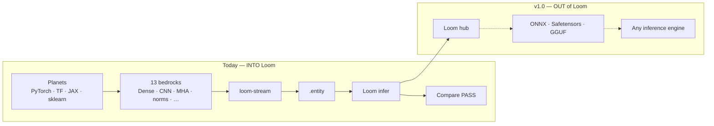

# Planet Bridging

**Universal bridging between AI engines through Loom.**

Planet Bridging is the project that maps how models move between **AI runtimes** (“planets”) and **Loom’s volumetric runtime**. Each major framework — PyTorch, TensorFlow, JAX, ONNX Runtime, llama.cpp, CoreML, and others — speaks its own formats, operator dialects, and execution models. Models do not travel freely; they get converted, lose fidelity, or stay locked to one stack.

Planet Bridging exists so weights and topology can flow **into Loom** today (live stream → `.entity` → Loom infer), and **out of Loom** tomorrow (export to hub formats → any inference engine).

Implementation lives in the sibling repo [`planetbridging/`](../planetbridging/). The **PyPI package** (`planetbridging`, currently **v0.7.3**) is the end-user lane: `pip install` + bundled `loom-stream` — no git clone, no `go build`, no compare-host HTTP.

Related Loom docs: [entity.md](entity.md) (what `.entity` is), [serialization.md](serialization.md) (JSON + ENTITY persistence), [bedrock_validation.md](bedrock_validation.md) (Lucy seven-layer CPU gate inside Loom), [layers.md](layers.md) (volumetric layer types).

---

## What it means

### Planets and the hub

Think of the AI ecosystem as a solar system:

| Term | Meaning |
|:-----|:--------|
| **Planet** | A training or inference runtime (PyTorch, TensorFlow, JAX, ORT, llama.cpp, …) |
| **Hub format** | Interchange layer between planets (Safetensors, ONNX, GGUF) |
| **Loom** | Deterministic volumetric DNVM at the center — native `.entity` checkpoints, 21 dtypes, pure Go CPU + WebGPU |

Planet Bridging is **not** “reimplement every engine.” It is **layer-aware translation**: map foreign ops to Loom’s `VolumetricLayer` types (Dense, CNN1/2/3, MHA, LSTM, …), stream weights in a canonical JSON contract, and build a Loom network that forward-matches the native planet on shared fixtures.

### Two halves of the bridge

| Direction | Status (2026) | What it means for you |
|:----------|:--------------|:----------------------|
| **Planets → Loom** | ✅ **Complete** (compare-host v0.5.0; PyPI package v0.7.x) | Train or load in PyTorch/TF/JAX → stream live weights → `.entity` → Loom infer matches native |
| **Loom → planets** | ⬜ **v1.0 target** | Export Loom brains → Safetensors / ONNX / GGUF → ORT, llama.cpp, CoreML, … |
| **File import (no live Python)** | ⬜ **v1.x** | Drop a `.safetensors` / `.onnx` / `.keras` on disk and ingest without a running planet |

Versioning intuition: **0.5 + 0.5 ≈ 1.0** — first half is *into* Loom; second half is *out of* Loom.

---

## How it works (planets → Loom)

This is **live weight streaming**, not a classic ONNX → Safetensors → Loom file pipeline.

```
┌─────────────────┐     JSON layer stream      ┌──────────────┐     ┌─────────────┐
│  AI planet      │  ───────────────────────►  │ loom-stream  │ ──► │  .entity    │
│  PyTorch / TF   │   (weights + topology)     │  (Go CLI)    │     │  checkpoint │
│  JAX / sklearn  │                            └──────┬───────┘     └──────┬──────┘
└─────────────────┘                                   │                    │
       │                                              │                    ▼
       │ native forward on fixtures                   │              Loom infer
       └──────────────── compare ─────────────────────┴──────── PASS / EXACT / DIFF
```

1. **Bedrock** — a POC harness per Loom layer family (`python/dense/`, `python/mha/`, …). Each bedrock defines manifest models, fixtures, and per-planet engine handlers.
2. **Planet handler** — Python reads **live in-memory weights** from the framework, builds the stream payload, and calls `loom-stream` (HTTP in the compare host; patched to CLI in the PyPI package).
3. **`loom-stream`** — Go binary (`planetbridging/cmd/loom-stream/`) calls `bridge.BuildNetworkFrom*Stream` and writes a `.entity` file.
4. **Compare** — native planet forward vs Loom forward on the same `x_test` samples. Labels: **EXACT**, **PASS** (within fp32 tolerance), **DIFF**.



---

## The 13 bedrock layer types

Each row is a **Loom volumetric layer family** with a planetbridging bedrock. All support PyTorch, TensorFlow, and JAX live streaming unless noted.

| Loom layer | Bedrock ID | Typical foreign ops | Notes |
|:-----------|:-----------|:--------------------|:------|
| **Dense** | `dense` | `Linear`, `Dense`, `Gemm` | sklearn on dense only; deepest multi-layer MLP POC |
| **CNN1** | `cnn1` | `Conv1d` | 2-layer stack POC |
| **CNN2** | `cnn2` | `Conv2d` | 2-layer stack POC |
| **CNN3** | `cnn3` | `Conv3d` | 2-layer stack POC |
| **MHA** | `mha` | `MultiHeadAttention` | causal + RoPE POC |
| **LSTM** | `lstm` | `LSTM` cell | |
| **RNN** | `rnn` | `RNN` / `SimpleRNN` | |
| **LayerNorm** | `layernorm` | `LayerNormalization` | |
| **Embedding** | `embedding` | `Embedding` lookup | often **EXACT** match |
| **RMSNorm** | `rmsnorm` | RMS normalization | |
| **SwiGLU** | `swiglu` | gated MLP (LLaMA-style) | |
| **Residual** | `residual` | skip connection | |
| **Mixer** | `mixer` | integration stack | v2 chains all 12 types (16 layers); POC tolerance ~5e-5 |

**Bedrock** here means: shared fixtures, manifest models, native forward reference, and stream builders — the “proof layer” that a planet’s weights map correctly into Loom. Lucy’s [seven-layer CPU suite](bedrock_validation.md) validates Loom internals; planetbridging bedrocks validate **cross-planet** parity.

---

## PyPI package (v0.7.3) — pip-only workflow

### Install

```bash
pip install 'planetbridging[pytorch,welvet]==0.7.3'
# optional cross-engine:
pip install 'planetbridging[tensorflow,jax]'
```

**Python ≥ 3.10.** The wheel ships:

| Bundled asset | Purpose |
|:--------------|:--------|
| `planetbridging/_data/python/` | All bedrock POC code + manifests |
| `planetbridging/_bin/<platform>/loom-stream` | linux_amd64, windows_amd64, macos_arm64 |
| `planetbridging/examples/` | Runnable demos |

Fixture `.npz` files are **not** in the wheel (PyPI 100 MB limit). They generate once on first use into `~/.planetbridging/fixtures/` (~86 MB total). Override with `PLANETBRIDGING_FIXTURES_CACHE`.

### Minimal example

```python
from planetbridging import engines

result = engines.stream("mha", "pytorch")
print(result.native_vs_loom)   # PASS
print(result.entity_path)      # path to .entity
```

### Three-way ladder (native → loom-stream → welvet)

[Welvet](../welvet/) is Loom’s Python binding (`welvet` on PyPI). After streaming, reload the same `.entity` and compare forwards:

```python
from planetbridging import engines

result = engines.stream("cnn1", "pytorch", try_welvet=True)
# result.native, result.loom_stream, result.welvet — all compared
```

Welvet reload is solid on: `cnn1`–`cnn3`, `mha`, `layernorm`, `embedding`, `rmsnorm`, `swiglu` (and mostly `dense`). Still flaky: `lstm`, `rnn`, `mixer`, `residual`.

---

## Python API surface

### Primary: `engines`

```python
from planetbridging import engines

engines.stream("layernorm", "tensorflow")           # one bedrock, one planet
engines.stream_all_planets("cnn2")                  # PyTorch + TF + JAX on same layer
engines.stream_all_bedrocks("pytorch")              # all 13 types
engines.ladder("mha", "numpy")                        # numpy ref → loom → welvet
engines.available_planets("dense")                    # ('pytorch', 'tensorflow', 'jax', 'sklearn')
engines.installed_planets("dense")                    # what's importable right now
```

Returns `EngineStreamResult`: `entity_path`, `native`, `loom_stream`, compare labels, optional `welvet` arrays.

### Custom dense models: `absorb`

For **your own** sequential fully-connected stack (not manifest POC models):

```python
import torch
from planetbridging import absorb

model = torch.nn.Sequential(
    torch.nn.Linear(32, 64),
    torch.nn.ReLU(),
    torch.nn.Linear(64, 8),
)

result = absorb.pytorch(model, input_dim=32, layer_units=[64, 8], output_path="my.entity")
```

Also: `absorb.keras()`, `absorb.jax()`, `absorb.sklearn()` — **dense stacks only**.

### Low-level: `stream`

```python
from planetbridging.stream import stream_bedrock, stream_dense, stream_mha
```

Direct JSON envelope → `loom-stream` → `StreamResult`. Used by smoke tests and advanced callers.

### Smoke / ladder (numpy reference)

```python
from planetbridging import run_bedrock_smoke, run_bedrock_ladder

run_bedrock_smoke("layernorm")          # numpy native → loom-stream, no live torch
run_bedrock_ladder("mha", try_welvet=True)
```

---

## What you can do today

| Goal | Supported? | How |
|:-----|:-----------|:----|
| Stream POC models from PyTorch into Loom `.entity` | ✅ | `engines.stream(bedrock, "pytorch")` |
| Same from TensorFlow / JAX | ✅ | `engines.stream(bedrock, "tensorflow")` etc. |
| All 13 Loom layer types in one pip install | ✅ | `pip install planetbridging[pytorch]` |
| Verify native matches Loom numerically | ✅ | `native_vs_loom` label on every stream |
| Reload `.entity` in Python via welvet | ✅ / partial | `try_welvet=True` or `welvet.Network.deserialize_entity` |
| Bring your own **dense MLP** from Keras/PyTorch | ✅ | `absorb.keras()` / `absorb.pytorch()` |
| Bring arbitrary **custom CNN / Transformer** architecture | 🟡 | Must map to a bedrock layer type or build low-level stream payloads |
| Import a **SavedModel / ONNX file** without live Python | ⬜ | v1.x — not in PyPI package yet |
| Export Loom → ONNX / GGUF / Safetensors | ⬜ | v1.0 roadmap |
| 21-dtype parity across planets | 🟡 | Planets train fp32; Loom supports 21 dtypes natively — bridge compares float outputs at one precision |

### What “import into Loom” actually means

You are **not** dropping an arbitrary TensorFlow graph into a black box. You are:

1. Expressing weights in Loom’s **volumetric layer vocabulary** (one of the 13 bedrock types, or a dense stack via `absorb`).
2. Streaming those weights through **`loom-stream`** into a native [`.entity`](entity.md) checkpoint.
3. Running Loom forward and proving it matches the source planet on shared test inputs.

That `.entity` is the same format Lucy **[7]** uses for save/reload — topology + native-packed weights in one binary file.

---

## Compare host vs PyPI package

| Mode | Audience | Entry |
|:-----|:---------|:------|
| **Compare host** | Developers, visual QA | `cd planetbridging && go run .` → dashboard on `:9876`, 13 tabs |
| **PyPI package** | End users, CI, notebooks | `pip install planetbridging` → Python API, bundled `loom-stream` |

The compare host uses HTTP (`POST /api/v1/loom/stream/*`). The PyPI package **patches** those calls to invoke `loom-stream` as a subprocess — same JSON contract, no server required.

---

## Environment variables

| Variable | Effect |
|:---------|:-------|
| `PLANETBRIDGING_FIXTURES_CACHE` | Directory for generated fixture `.npz` (default `~/.planetbridging/fixtures/`) |
| `PLANETBRIDGING_ROOT` | Force bedrock data root (dev checkout); unset for pip wheel |
| `PLANETBRIDGING_LOOM_STREAM` | Explicit path to `loom-stream` binary |

---

## Examples (shipped in wheel)

| Script | Demonstrates |
|:-------|:-------------|
| `01_hello_stream.py` | One bedrock → `.entity` |
| `02_all_layer_types.py` | All 13 bedrocks |
| `03_cross_engine.py` | PyTorch / TensorFlow / JAX on same bedrock |
| `04_multi_layer_models.py` | Multi-layer MLP, CNNs, Mixer v2 |
| `05_welvet_ladder.py` | native → loom-stream → welvet |
| `06_showcase_everything.py` | Full API tour |

```bash
EXAMPLES=$(python -c "import pathlib, planetbridging as pb; print(pathlib.Path(pb.__file__).parent / 'examples')")
python "$EXAMPLES/01_hello_stream.py"
python "$EXAMPLES/05_welvet_ladder.py" cnn1 mha
```

Outputs land in `./.planetbridging/examples/` under your current working directory.

---

## Roadmap — what it could do

### v1.0 — Loom → other engines

Export from Loom hub formats, then route to any inference planet:

```
Loom .entity  →  Safetensors / ONNX / GGUF  →  ORT · llama.cpp · CoreML · …
```

### v1.x — file-based import

Pure-Go readers in the bridge (no live Python planet):

| Priority | Format | Planet |
|:---------|:-------|:-------|
| 1 | `.safetensors` + manifest | PyTorch / HF |
| 2 | `.onnx` | PyTorch export |
| 3 | `.keras` | TensorFlow |
| 4 | `saved_model/` | TensorFlow (harder) |

See [`planetbridging/python/dense/README.md`](../planetbridging/python/dense/README.md) for stdlib-only feasibility notes.

### v1.x → 2.0 — completeness

- More layer types (ConvTranspose, Softmax, …)
- More planets (ONNX Runtime live, Paddle, …)
- Tighter deep-stack determinism (Mixer v2 from POC → PASS)
- Documented lossy conversion paths

---

## Repo layout (planetbridging/)

| Path | Purpose |
|:-----|:--------|
| [`planetbridging/host/`](../planetbridging/host/) | Compare dashboard HTTP server |
| [`planetbridging/bridge/`](../planetbridging/bridge/) | Go stream builders → `.entity` per layer type |
| [`planetbridging/cmd/loom-stream/`](../planetbridging/cmd/loom-stream/) | CLI: JSON stdin → `.entity` |
| [`planetbridging/python/<bedrock>/`](../planetbridging/python/) | Per-layer POC: manifests, fixtures, planet handlers |
| [`planetbridging/src/planetbridging/`](../planetbridging/src/planetbridging/) | PyPI package (`engines`, `absorb`, `stream`, `_fixtures`) |
| [`planetbridging/examples/`](../planetbridging/examples/) | User-facing demos |
| [`planetbridging/PROGRESS.md`](../planetbridging/PROGRESS.md) | Live per-model PASS/DIFF scoreboard |
| [`planetbridging/BRIDGE.md`](../planetbridging/BRIDGE.md) | Architecture diagrams |

---

## How this fits Loom

| Loom concept | Planet Bridging role |
|:-------------|:---------------------|
| [`VolumetricNetwork`](../poly/poly.go) | Target topology built from streamed layers |
| [`.entity` checkpoint](entity.md) | **Output** of a successful stream — ship-ready native brain |
| [21 DTypes](numerical_types.md) | Loom-native; bridge compares fp32 planet outputs today |
| [Welvet C-ABI](../welvet/) | Reload streamed `.entity` in Python/Flutter/TS for inference |
| [HF Safetensors import](serialization.md) | Separate path (SoulGlitch, Lucy [8]); planetbridging complements with **live** multi-planet streams |
| [Bedrock validation](bedrock_validation.md) | Internal Loom CPU gate; planetbridging bedrocks are **external** parity gate |

**One sentence:** Planet Bridging lets you build or train on the planet you already use, stream weights into Loom’s native `.entity` format, and prove Loom runs the same math — with a pip-installable path that needs no Go toolchain on the user machine.

---

## Related links

- [planetbridging on PyPI](https://pypi.org/project/planetbridging/)
- [planetbridging README](../planetbridging/README.md) — release matrix, compare host quick start
- [entity.md](entity.md) — ENTITY format spec
- [flutter.md](flutter.md) — welvet on mobile
- [v080_release.md](v080_release.md) — Loom v0.80 ENTITY + Planet Bridging POC milestone
