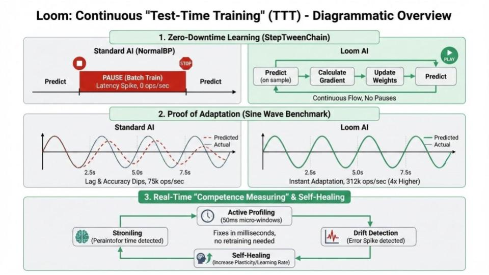
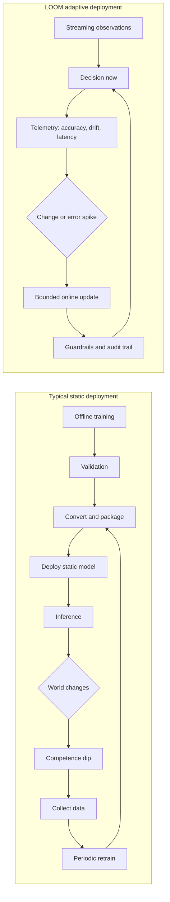
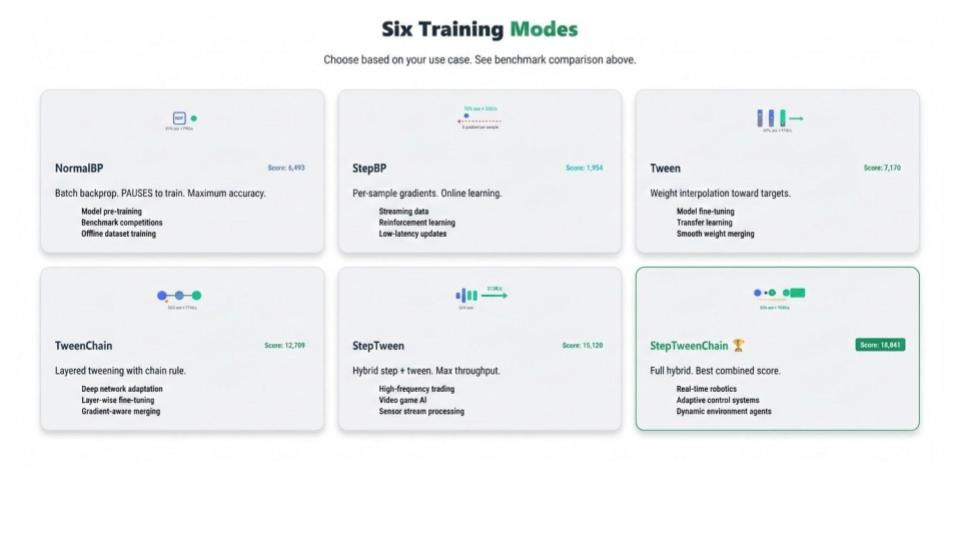

# Adaptive Online Learning for Real-Time Threat Detection

Research note / benchmark artifact for LOOM, based on Samuel Watson's PhD EOI
"Adaptive Online Learning for Real-Time Threat Detection" (07 Jan 2026).

Core question:

> How do learning systems remain competent while the world changes faster than
> they can retrain?

This example is a controlled change-point benchmark. It is not a production
threat detector by itself. It is a small testbed for measuring whether a model
can keep producing decisions while its objective changes mid-stream.

The operating belief behind the benchmark is simple: in real-time monitoring,
having training options is better than having none, and in many deployed
systems any timely decision is better than no decision while the system waits
for offline retraining.

## Why This Exists

Most ML deployment pipelines are still one-way:

1. train offline
2. validate
3. convert/package
4. deploy
5. periodically retrain

That loop is useful, but it assumes the world waits. Real monitoring systems do
not get that luxury. Traffic baselines drift, exploit chains mutate, benign
patterns change, and adversarial behavior can shift while the detector is
already serving decisions.

For post-deployment threat detection, raw accuracy is not enough. A useful
system also needs:

- availability: inference should not pause while learning happens
- decision activity: the system should keep producing decisions on deadline
- latency control: learning should not create long response gaps
- recovery: competence dips after task changes should be shallow and short
- observability: drift, blocked time, latency, and update behavior should be auditable
- portability: behavior should be measurable across CPU, GPU, WebGPU, and edge devices

LOOM explores this space by treating training as an operational mode, not only
as an offline stage.

## Concept



Figure: conceptual overview of zero-downtime learning, adaptation under
frequency switches, and telemetry-driven self-healing.



The goal is continuous competence: high-enough accuracy, no inference pause,
short decision gaps, and measurable recovery when the task changes.

## Benchmark

The dense adaptation benchmark runs a 15 second embodied control task:

- 0-5s: chase the target
- 5-10s: avoid the target
- 10-15s: chase the target again

The model receives an 8-value observation:

- agent position
- target position
- relative target vector
- distance
- current task flag

It outputs one of four actions: up, down, left, or right.

Network:

```text
6-layer Dense: 8 -> 32 -> 64 -> 64 -> 64 -> 32 -> 4
Engine: loom/poly VolumetricNetwork
```

Run:

```text
cd lucy
go run .
# choose option 2
```

Each mode receives the same deterministic environment stream. The comparison is
therefore about update behavior, not about different target paths.

## Six Training Modes



Figure: high-level comparison of the six training/update modes explored across
the adaptation benchmarks.

| Mode | Update style | Best use case | Main tradeoff |
| --- | --- | --- | --- |
| `NormalBP` | Periodic batch training via `poly.Train` | Offline or server-side jobs where throughput matters and brief training pauses are acceptable. | Can learn strongly in bursts, but may pause or lag while the world changes. |
| `Step+BP` | Backprop update after each action output | Online adaptation where correctness matters and gradient cost is acceptable. | Always available, but heavier per-decision compute. |
| `Tween` | Target-propagation style updates in periodic batches | Lightweight adaptation in batch windows. | Lower cost than BP, but still waits for batch intervals. |
| `TweenChain` | Chain-rule tween updates in periodic batches | More gradient-aware batched target propagation. | Can adapt sharply to one regime, but still has batch-window lag and blocking. |
| `StepTween` | Target-propagation update after each action output | Ultra-reactive "keep neural activity moving" mode where any timely action is preferable to waiting. | Can be highly available and fast but may be weak without chain-rule signal. |
| `StepTweenChain` | Chain-rule tween update after each action output | Real-time adaptive agents where the model should keep acting and learning at the same time. | Lower throughput than simple forward paths, but usually the best online competence/availability compromise. |

Current poly note: this example keeps the `StepTween` and `StepTweenChain`
research semantics, "update after every output", but it does not yet use
`poly.StepState` directly for this variable-width dense stack. The current
generic step buffer assumes compatible layer widths and can route an 8-wide
input into a 32-wide layer. This benchmark therefore uses `poly.TweenForward`,
`poly.TweenBackward`, and `poly.ApplyTweenGaps` every output for the StepTween
variants. Full variable-width step-mesh parity is the next implementation
target.

## How To Read The Scores

There is no single universal winner. Each metric answers a different deployment
question.

| Question | Metric to inspect | Why |
| --- | --- | --- |
| Did it adapt after a task change? | `1st Change`, `2nd Change`, `Adapt delay` | Measures immediate behavior around change-points. |
| Which phase did it understand best? | `Chase1`, `Avoid`, `Chase2` | Separates first learning, reversal, and return-to-original-task behavior. |
| Did it ever recover? | `Peak1`, `Peak2` | Shows best post-change competence even if the average is low. |
| Did competence collapse? | `Floor`, `Dip`, `Competence Smooth` | Captures worst windows and volatility. |
| Did it keep making decisions? | `Decisions`, `Hit Rate`, `Await ms`, `Activity` | Measures neural activity against a real-time deadline. |
| Did it avoid pauses? | `Availability`, `Blocked ms`, `No-Pause` | Shows whether training blocked the decision loop. |
| Was it good while available? | `ZDT`, `Reactive` | Combines competence with zero-downtime / deadline behavior. |
| Was it simply fast? | `Throughput/s`, `Score` | Rewards high action volume, useful for bulk serving comparisons. |

This matters for threat detection because no-decision time is operationally
dangerous. A static model that is "accurate after retraining" may still fail the
real system if it pauses or misses the window where a decision was needed.

## Equations

```text
AvgAcc = mean(all 15 one-second accuracy windows)

Chase1 = mean(windows 1-5)
Avoid  = mean(windows 6-10)
Chase2 = mean(windows 11-15)

Peak1 = max(windows 6-10)
Peak2 = max(windows 11-15)
Floor = min(windows 1-15)

Dip1 = max(0, accuracy_window_5 - accuracy_window_6)
Dip2 = max(0, accuracy_window_10 - accuracy_window_11)

Return% = Chase2 / max(Chase1, epsilon) * 100

Availability% = (runtime - blocked_training_time) / runtime * 100

Score = ThroughputPerSecond * Availability% * AvgAcc / 10,000

ZDT = AvgAcc * Availability% / 100

Eff/ms = AvgAcc / AverageLatencyMilliseconds

DeadlineHit% = decisions_completed_within_deadline / all_decisions * 100

AwaitMS = sum(max(0, decision_latency - deadline))

Activity = Availability% * DeadlineHit% / 100

Reactive = ZDT * DeadlineHit% / 100

Smoothness = 100 - mean(abs(delta between adjacent accuracy windows))

CompetenceSmooth = AvgAcc - mean(abs(delta between adjacent accuracy windows))
```

Why several scores exist:

- `Score` rewards raw throughput, so high-output modes can look strong even when their competence is modest.
- `ZDT` removes throughput dominance and asks: "how competent was the model while staying available?"
- `Activity` asks: "was there neural activity in time to act on the moving target?"
- `Reactive` combines zero-downtime competence with deadline-hit behavior.
- `CompetenceSmooth` avoids rewarding a model for being smoothly wrong at 0%.

## Latest Poly Run

Captured run:

```text
NormalBP outputs:       198,665
Step+BP outputs:         33,475
Tween outputs:          135,026
TweenChain outputs:     120,748
StepTween outputs:       86,192
StepTweenChain outputs:  28,682
```

### Accuracy Timeline

| Mode | 1s | 2s | 3s | 4s | 5s | 6s | 7s | 8s | 9s | 10s | 11s | 12s | 13s | 14s | 15s |
| --- | ---: | ---: | ---: | ---: | ---: | ---: | ---: | ---: | ---: | ---: | ---: | ---: | ---: | ---: | ---: |
| `NormalBP` | 0% | 0% | 0% | 0% | 0% | 99% | 67% | 29% | 60% | 100% | 0% | 0% | 0% | 0% | 0% |
| `Step+BP` | 0% | 3% | 20% | 8% | 21% | 95% | 100% | 100% | 100% | 100% | 33% | 43% | 36% | 39% | 31% |
| `Tween` | 0% | 0% | 0% | 0% | 0% | 8% | 64% | 99% | 99% | 100% | 0% | 0% | 0% | 0% | 0% |
| `TweenChain` | 0% | 0% | 0% | 0% | 0% | 100% | 100% | 100% | 100% | 83% | 0% | 0% | 0% | 0% | 0% |
| `StepTween` | 0% | 0% | 0% | 0% | 0% | 1% | 0% | 0% | 0% | 32% | 0% | 0% | 0% | 0% | 0% |
| `StepTweenChain` | 0% | 12% | 13% | 32% | 37% | 95% | 100% | 100% | 100% | 100% | 28% | 22% | 2% | 0% | 0% |

### Adaptation Summary

| Mode | Outputs | 1st change | 1st dip | 2nd change | 2nd dip | Avg acc |
| --- | ---: | ---: | ---: | ---: | ---: | ---: |
| `NormalBP` | 198,665 | 0% -> 99% (0s) | 0.0% | 100% -> 0% (N/A) | 99.9% | 23.7% |
| `Step+BP` | 33,475 | 21% -> 95% (0s) | 0.0% | 100% -> 33% (N/A) | 66.8% | 48.6% |
| `Tween` | 135,026 | 0% -> 8% (1s) | 0.0% | 100% -> 0% (N/A) | 100.0% | 24.7% |
| `TweenChain` | 120,748 | 0% -> 100% (0s) | 0.0% | 83% -> 0% (N/A) | 83.4% | 32.2% |
| `StepTween` | 86,192 | 0% -> 1% (N/A) | 0.0% | 32% -> 0% (N/A) | 32.2% | 2.2% |
| `StepTweenChain` | 28,682 | 37% -> 95% (0s) | 0.0% | 100% -> 28% (N/A) | 72.4% | 42.6% |

### Phase / Recovery Metrics

| Mode | Chase1 | Avoid | Chase2 | Peak1 | Peak2 | Floor | Return% | ZDT | Eff/ms | Competence / smoothness |
| --- | ---: | ---: | ---: | ---: | ---: | ---: | ---: | ---: | ---: | ---: |
| `NormalBP` | 0.0% | 71.0% | 0.0% | 99.9% | 0.0% | 0.0% | 0.0% | 20.7 | 313.5 | 0.0 / 75.9 |
| `Step+BP` | 10.4% | 98.9% | 36.4% | 100.0% | 43.1% | 0.0% | 350.0% | 48.6 | 108.5 | 33.0 / 84.4 |
| `Tween` | 0.0% | 74.1% | 0.0% | 100.0% | 0.0% | 0.0% | 0.0% | 23.1 | 222.6 | 10.4 / 85.7 |
| `TweenChain` | 0.0% | 96.7% | 0.0% | 100.0% | 0.0% | 0.0% | 0.0% | 26.5 | 259.6 | 17.9 / 85.7 |
| `StepTween` | 0.0% | 6.6% | 0.0% | 32.2% | 0.0% | 0.0% | 0.0% | 2.2 | 12.7 | 0.0 / 95.3 |
| `StepTweenChain` | 18.6% | 98.9% | 10.3% | 100.0% | 27.6% | 0.0% | 55.5% | 42.6 | 81.5 | 28.3 / 85.7 |

### Decision Activity Metrics

| Mode | Decisions | Hit rate | Misses | Await ms | Worst gap | Activity | Reactive | No-pause |
| --- | ---: | ---: | ---: | ---: | ---: | ---: | ---: | ---: |
| `NormalBP` | 198,665 | 100.0% | 2 | 6.6 | 16 ms | 87.6% | 20.7 | 87.6% |
| `Step+BP` | 33,475 | 100.0% | 1 | 1.1 | 11 ms | 100.0% | 48.6 | 100.0% |
| `Tween` | 135,026 | 100.0% | 1 | 5.0 | 15 ms | 93.4% | 23.1 | 93.4% |
| `TweenChain` | 120,748 | 99.8% | 220 | 265.7 | 15 ms | 82.0% | 26.4 | 82.2% |
| `StepTween` | 86,192 | 100.0% | 0 | 0.0 | 7 ms | 100.0% | 2.2 | 100.0% |
| `StepTweenChain` | 28,682 | 100.0% | 1 | 3.4 | 13 ms | 100.0% | 42.6 | 100.0% |

### Operational Metrics

| Mode | Smoothness | Throughput/s | Availability | Blocked ms | Peak lat | Avg lat | Score | Runtime |
| --- | ---: | ---: | ---: | ---: | ---: | ---: | ---: | ---: |
| `NormalBP` | 75.9% | 13,244 | 87.6% | 1,858 | 16 ms | 75 us | 2,745 | 15s |
| `Step+BP` | 84.4% | 2,232 | 100.0% | 0 | 11 ms | 448 us | 1,084 | 15s |
| `Tween` | 85.7% | 9,002 | 93.4% | 983 | 15 ms | 111 us | 2,078 | 15s |
| `TweenChain` | 85.7% | 8,050 | 82.2% | 2,673 | 15 ms | 124 us | 2,132 | 15s |
| `StepTween` | 95.3% | 5,746 | 100.0% | 0 | 7 ms | 174 us | 127 | 15s |
| `StepTweenChain` | 85.7% | 1,912 | 100.0% | 0 | 13 ms | 523 us | 815 | 15s |

## What Shines Where

- `NormalBP` shines on raw throughput and can learn a stable phase strongly, but it can still collapse after a new switch and may block during training.
- `Step+BP` shines on online competence in this dense task: high average accuracy, no pause, strong `Reactive`, and decent return behavior.
- `Tween` shines as a lightweight batched adaptation option, especially when inference throughput matters more than strict online updates.
- `TweenChain` shines when chain-rule information helps a batched tween mode lock onto a phase, but the batch behavior can still lag or block.
- `StepTween` shines as pure activity: it kept a 100% hit rate, zero deadline misses, zero await time, and no pause. In this run it was not competent, but it demonstrates the "always decide" axis.
- `StepTweenChain` shines as the real online target-propagation story: no-pause behavior plus meaningful competence, especially during the first chase and avoid phases.

For real-time monitoring, this is the point: a deployed system should not be
limited to one training behavior. Sometimes the right answer is maximum
throughput. Sometimes it is no-pause online BP. Sometimes it is a lightweight
tween update. Sometimes the most important requirement is simply that neural
activity keeps up with the moving target and produces a decision on time.

## Threat Detection Mapping

In this benchmark, "chase" vs "avoid" is deliberately simple. In a monitoring
system, equivalent task shifts might be:

- a new exploit chain appearing in logs
- a botnet changing phase or command-and-control pattern
- benign traffic baselines drifting after a deployment or business event
- adversarial pressure that invalidates yesterday's decision boundary

The operational question is the same: how long does the detector remain wrong,
and does it have to stop serving while it learns?

In a cyber setting, the mode choice might look like this:

- Use `NormalBP` for scheduled retraining or high-throughput server jobs.
- Use `Step+BP` when correctness under drift matters more than raw throughput.
- Use `Tween` / `TweenChain` for lighter adaptive updates where batch windows are acceptable.
- Use `StepTween` when maintaining a live decision stream matters more than immediate accuracy.
- Use `StepTweenChain` when the system needs live decisions and meaningful online adaptation.

## Earlier Sine-Wave Evidence

The same research question was previously tested with a sine-wave frequency
switching benchmark:

```text
Sin(1x) -> Sin(2x) -> Sin(3x) -> Sin(4x)
```

That benchmark measured accuracy, stability, throughput, availability, blocked
time, peak latency, average latency, and an availability-weighted score:

```text
Score = (Throughput * Availability% * Accuracy%) / 10,000
```

In that benchmark, `StepTweenChain` had the best availability-weighted score:

| Mode | Accuracy | Throughput | Availability | Blocked | Peak latency | Score | Interpretation |
| --- | ---: | ---: | ---: | ---: | ---: | ---: | --- |
| `NormalBP` | 89.8% | 33,030 | 32.4% | 6,760 ms | 37.9 ms | 9,619 | High accuracy, but blocks during batch training. |
| `StepBP` | 75.3% | 16,002 | 100.0% | 0 ms | 8.6 ms | 12,049 | Always available, lower throughput. |
| `Tween` | 36.8% | 52,770 | 56.6% | 4,343 ms | 16.0 ms | 10,984 | Some blocking during training. |
| `TweenChain` | 24.2% | 52,267 | 56.6% | 4,340 ms | 15.9 ms | 7,149 | Some blocking, higher stability. |
| `StepTween` | 36.7% | 88,624 | 100.0% | 0 ms | 9.1 ms | 32,485 | Always available, weaker accuracy. |
| `StepTweenChain` | 52.7% | 89,836 | 100.0% | 0 ms | 8.2 ms | 47,348 | Always available, best availability-weighted score. |

## Research Aims

1. Define "competence under change" for deployed ML systems.

   The metric should include accuracy, availability, decision activity, latency
   spikes, recovery time after change-points, and drift across heterogeneous
   devices.

2. Build adaptive online learning methods that remain useful during rapid shift.

   The working hypothesis is that step-wise updates can reduce the depth and
   duration of competence dips compared with batch-only retraining.

3. Engineer trustworthy deployment and observability.

   Online updates need guardrails: bounded learning rates, poisoning resistance,
   validation gates, drift telemetry, reproducibility checks, and rollback.

4. Demonstrate the method in threat detection scenarios.

   The target domain is streaming monitoring where baselines evolve and
   adversarial behavior changes after deployment.

## Related Artifacts

- LOOM: https://github.com/openfluke/loom
- Paragon ISO Telemetry: https://github.com/openfluke/iso-demo
- Real-Time Adaptation Benchmark video: https://www.youtube.com/watch?v=ngxe3gVtbBU
- Primecraft demo 1: https://www.youtube.com/watch?v=4oeg5mZUuo0
- Primecraft demo 2: https://www.youtube.com/watch?v=e9Le_SDyYV8
- MicroPacketGuardian: https://github.com/planetbridging/MicroPacketGuardian
- MicroPacketGuardian demo: https://www.youtube.com/watch?v=jLRQjlxLykg
- Flamekeeper: https://github.com/openfluke/flamekeeper
- Flamekeeper demo: https://www.youtube.com/watch?v=WMcK1ZvIsNk
- Legacy real-time adaptation test 17: https://github.com/openfluke/tva/blob/main/examples/tween/test17_realtime_decision.go
- Legacy sine-wave adaptation benchmark: https://github.com/openfluke/tva/blob/main/examples/all_sine_wave.go
